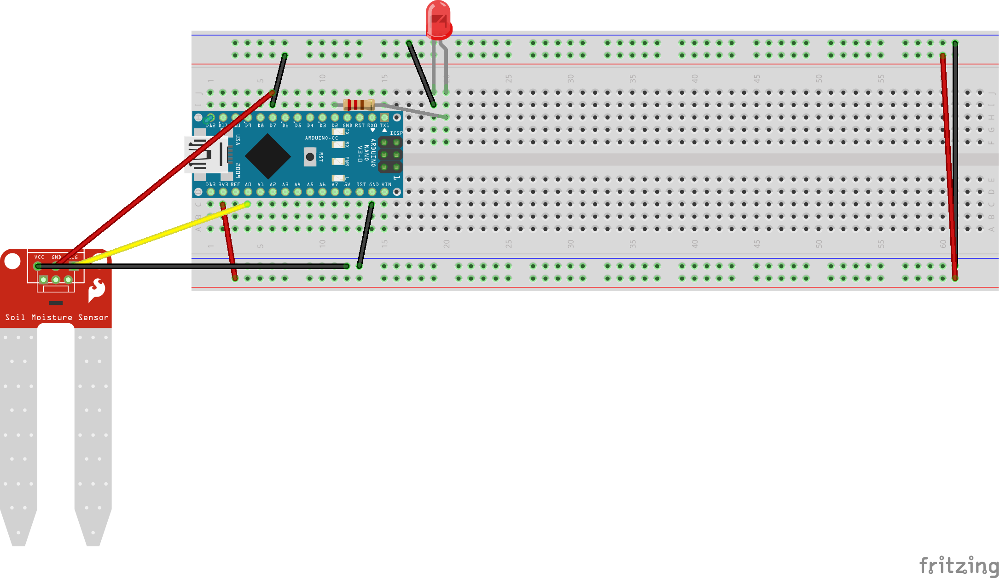

# Arduino Soil Moisture sensor
Using an arduino soil moisture, I calculate the soil moisture over several days to determine the threshold for watering my plant

The soil moisture sensor is not particularly sophisticated. It took 4 days of analysis (and my own expertise of knowing when to water my plant) to understand the analog number being read from the sensor. For my polka dot plant, I typically water it every 4-5 days. So the day after I watered my plant, the moisture sensor hit in the 400s. My plant was fully hydrated at the time By the second day, it ranged from 300-370 depending on where I placed the sensor. 3 days after watering, the sensor ranged around 240-290, again dependent on placement. After 4 days, it hovered close to 150-180. My conclusion is that once the sensor hits below 100, it is time for me to water my plant. When this happens, a red LED will turn on to let me know.

These numbers only really work for my specific plant. I did the same analysis on my roommate's plant -- a plant that requires watering every 12-14 days. The plant never reached above 12 with the sensor but her understanding of her plant obviously surpasses this sensors numbers.

Below you can see the schematic

Pictures of the setup

A video of the project:

